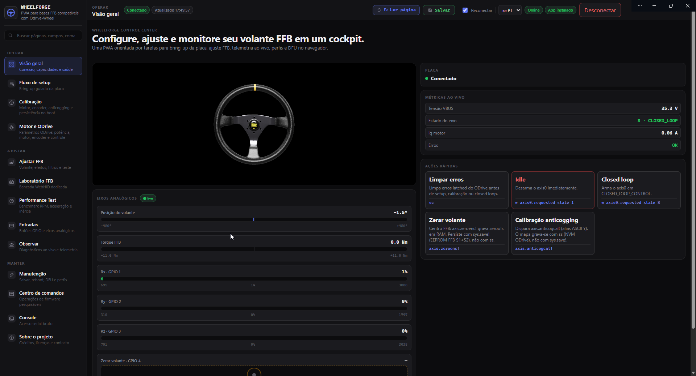
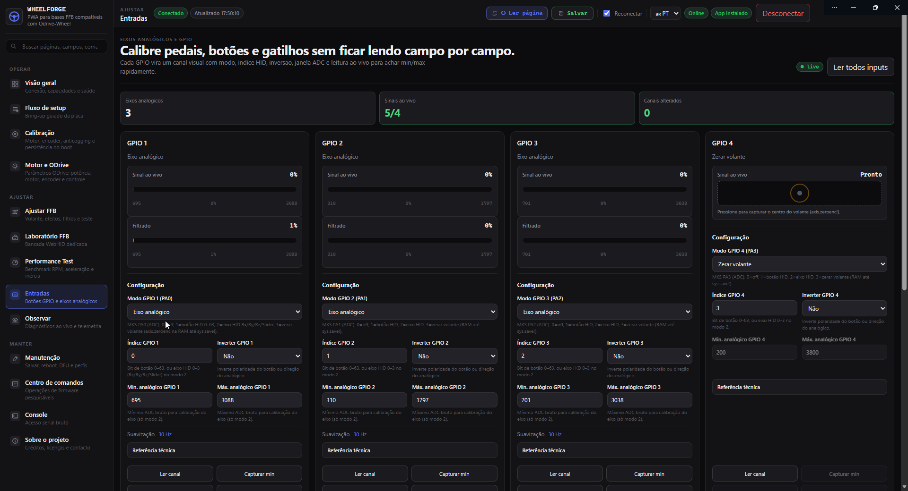
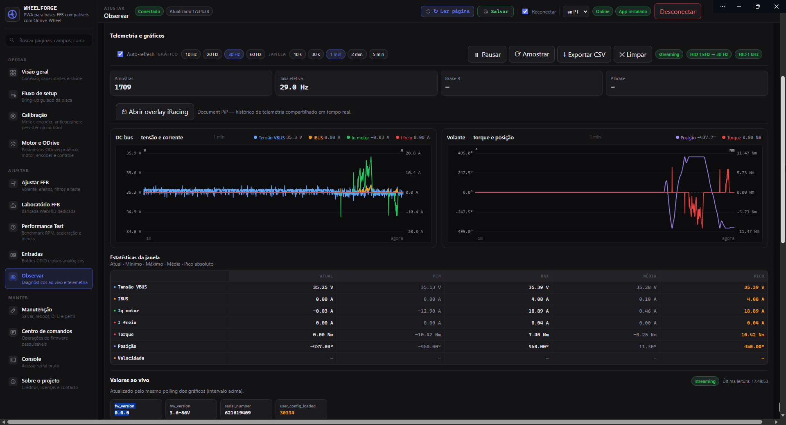
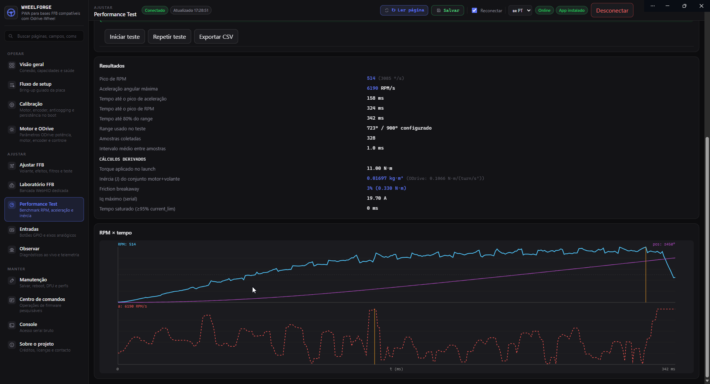

# WheelForge 🏎️⚡

[](https://react.dev/)
[](https://www.typescriptlang.org/)
[](https://vitejs.dev/)
[](https://bun.sh/)
[](https://web.dev/progressive-web-apps/)
[](https://odrivewheel.talkera.workers.dev/)
[](LICENSE)

> 🚀 **Acesse online**: [**https://odrivewheel.talkera.workers.dev/**](https://odrivewheel.talkera.workers.dev/)

**WheelForge** é uma Progressive Web App (PWA) de alto desempenho para configuração, ajuste fino, calibração e telemetria em tempo real para volantes Direct Drive FFB baseados no ecossistema **ODrive / Odrive-Wheel**.

Construído do zero com **React 19**, **Three.js** e **Web Serial / WebHID / WebUSB APIs**, o WheelForge substitui configuradores monolíticos legados por uma experiência moderna, fluida e orientada a workspaces dedicados.

---

## 📸 Demonstração & Telas do Projeto

### 1. Visão Geral (Cockpit Dashboard & Volante 3D)
> Visualizador de orientação do volante 3D em tempo real, monitoramento de VBUS, corrente Iq, estados da FSM, barras de pedais/analógicos com suavização 60Hz e atalhos rápidos com 1 clique (*Limpar erros, Idle, Closed loop, Zerar volante e Calibração Anticogging*).

<p align="center">
  
</p>

---

### 2. Entradas Analógicas & Mapeamento GPIO
> Painel visual com leitura dinâmica do conversor ADC, barras filtradas em tempo real, captura automática de mínimos e máximos por canal, inversão de eixo, modos de botão HID e suavização de sinal configurável.

<p align="center">
  
</p>

---

### 3. Observar & Telemetria Avançada
> Gráficos em tempo real com amostragem até 1 kHz HID, curvas de tensão DC bus, corrente do motor, torque FFB aplicado, posição angular precisa, tabela estatística de janela (mínimo, máximo, pico) e overlay PiP (*Picture-in-Picture*) para simuladores.

<p align="center">
  
</p>

---

### 4. Performance Test & Benchmark de Inércia
> Rotina automatizada de teste em 6 fases para medição de Pico de RPM, Aceleração Angular Máxima (RPM/s), Inércia mecânica do conjunto motor+volante ($J$), atrito estático (*friction breakaway*) e saturação de corrente.

<p align="center">
  
</p>

---

## ✨ Principais Funcionalidades

- 🧭 **Cockpit Integrado**: Visão geral com volante 3D interativo, estado de conexão, telemetria de barramento e botões de ação imediata.
- ⚡ **Fluxo de Setup Guiado**: Assistente passo-a-passo para bring-up de novas placas, calibração de motor, pares de polos, sentido de rotação e divisor de tensão VBUS.
- 🎛️ **Diagnóstico AS5047 & Encoders**: Ferramentas dedicadas para leitura de diagnóstico do encoder magnético AS5047 via SPI/ABI.
- 🏎️ **Ajuste FFB & Efeitos PID**: Curvas de torque, filtros de amortecimento (*damping*), inércia, fricção e bancada de teste de efeitos USB HID PID via WebHID.
- 🎮 **Gerenciamento de Entradas GPIO**: Suporte a pedais analógicos (acelerador, freio, embreagem), freio de mão e botões, com calibração intuitiva *min/max capture*.
- 📊 **Monitoramento em Alta Frequência**: Gráficos multi-canal a 60 Hz e telemetria HID de 1 kHz sem travamentos na UI.
- 💾 **Persistência Unificada**: Suporte a gravação em NVM ODrive e emulação EEPROM FFB, além de importação/exportação de perfis JSON.
- 🔄 **Atualizador DFU WebUSB**: Gravação de novos firmwares direto do navegador através do protocolo padrão DFU STM32.
- 🌐 **Internacionalização Completa**: Suporte nativo a Português (PT-BR) e Inglês (EN) com troca instantânea.

---

## 🛠️ Requisitos de Navegador

O WheelForge se comunica diretamente com a placa via APIs modernas da Web, eliminando a necessidade de drivers proprietários ou softwares intermediários pesados:

| API Web | Finalidade | Navegadores Compatíveis |
|---|---|---|
| **Web Serial** | Configuração, calibração, comandos e telemetria ODrive | Google Chrome, Microsoft Edge, Opera, Brave |
| **WebHID** | Bancada de teste de efeitos FFB e telemetria HID 1 kHz | Google Chrome, Microsoft Edge, Opera, Brave |
| **WebUSB (DFU)** | Atualização e gravação de firmware STM32 via USB | Google Chrome, Microsoft Edge, Opera, Brave |

> ⚠️ **Nota**: Navegadores como Firefox e Safari não possuem suporte nativo à Web Serial API.

---

## 🚀 Como Executar Localmente

### Pré-requisitos
- [Node.js](https://nodejs.org/) (v18+) ou [Bun](https://bun.sh/) (recomendado)

### Instalação e Execução

```bash
# 1. Clone o repositório
git clone https://github.com/TelksBr/OdriveAPP.git
cd OdriveAPP

# 2. Instale as dependências
bun install
# ou: npm install

# 3. Inicie o servidor de desenvolvimento
bun run dev
# ou: npm run dev
```

Abra a URL indicada no terminal (normalmente `http://localhost:5173`) no Chrome ou Edge.

---

## 📦 Scripts Disponíveis

| Comando | Descrição |
|---|---|
| `bun run dev` | Inicia o servidor de desenvolvimento com suporte a HMR e PWA |
| `bun run build` | Checagem de tipos TypeScript e compilação do bundle de produção |
| `bun run preview` | Executa um servidor local para testar a pasta `dist/` |
| `bun run typecheck` | Executa a validação do TypeScript (`tsc --noEmit`) |
| `bun test` | Executa a suíte de testes unitários automatizados |
| `bun run i18n:check` | Valida a paridade de chaves de tradução entre PT e EN |
| `bun run firmware:check` | Valida a superfície de comandos e campos do firmware |

---

## 📁 Arquitetura do Projeto

```text
OdriveAPP/
├── src/
│   ├── app/              # Shell da aplicação, tema, roteamento e estado global
│   ├── features/         # Módulos e workspaces:
│   │   ├── dashboard/    # Cockpit, visualizador 3D e eixos analógicos
│   │   ├── setup/        # Assistente de calibração passo-a-passo
│   │   ├── inputs/       # Configuração e calibração de GPIOs e pedais
│   │   ├── observe/      # Gráficos de telemetria e monitores em tempo real
│   │   ├── hid/          # Laboratório de efeitos WebHID FFB
│   │   ├── dfu/          # Flash e particionamento WebUSB STM32
│   │   └── config/       # Catálogo de propriedades ODrive e FFB
│   ├── domain/           # Tipos de domínio, pinagem GPIO e superfícies de comando
│   ├── i18n/             # Dicionários de internacionalização (PT / EN)
│   └── shared/           # Primitivas de UI (botões, cards, sliders, modais)
├── public/               # Modelos 3D (volante GLB), texturas e manifest PWA
├── docs/                 # Documentações técnicas de protocolo e capturas de tela
│   ├── firmware-api.md   # Especificação do protocolo Serial/HID
│   └── screenshots/      # Imagens demonstrativas do software
├── tools/                # Utilitários auxiliares e telemetria LAN/Assetto Corsa
└── vite.config.ts        # Configurações do Vite e plugin PWA
```

---

## 🔌 Compatibilidade de Hardware

O WheelForge foi projetado para operar com controladoras Direct Drive executando o firmware **[ODrive-Wheel-Forge](https://github.com/TelksBr/ODrive-Wheel-Forge)** (v1.0.0+):

- **MKS XDrive Mini** (STM32F405 + DRV8301)
- **ODESC V4.2**
- Clones compatíveis com hardware ODrive v3.6 (24V / 56V) com suporte a FFB HID OpenFFBoard.

---

## 🤝 Créditos & Agradecimentos

- **Telks ([@TelksBr](https://github.com/TelksBr))**: Manutenção e desenvolvimento do firmware ODrive-Wheel-Forge e WheelForge PWA.
- **OpenFFBoard**: Base para o protocolo FFB e emulação USB HID PID.
- **ODrive Robotics**: Plataforma de controle de motores de alta precisão.

---

## 📄 Licença

Este projeto é software livre sob os termos da licença [GPLv3](LICENSE).
